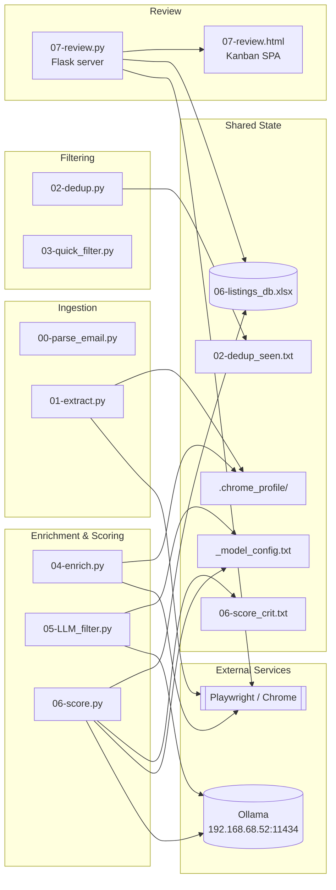
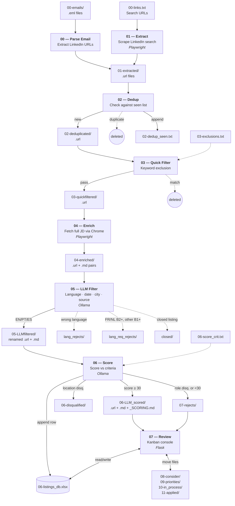
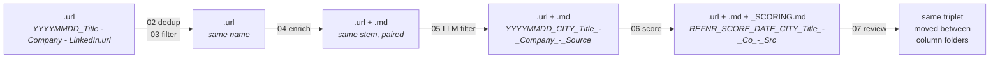
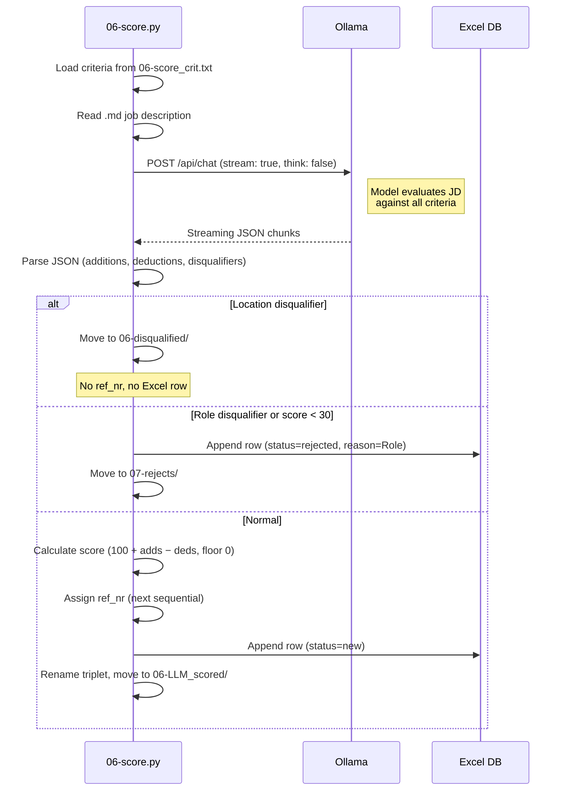
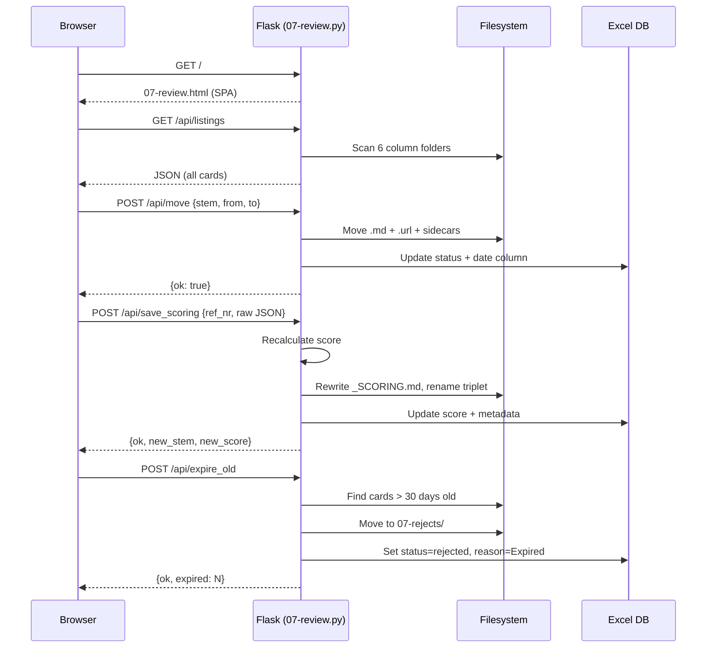
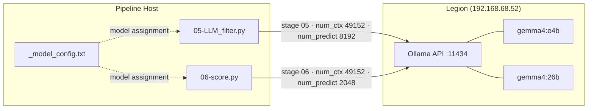
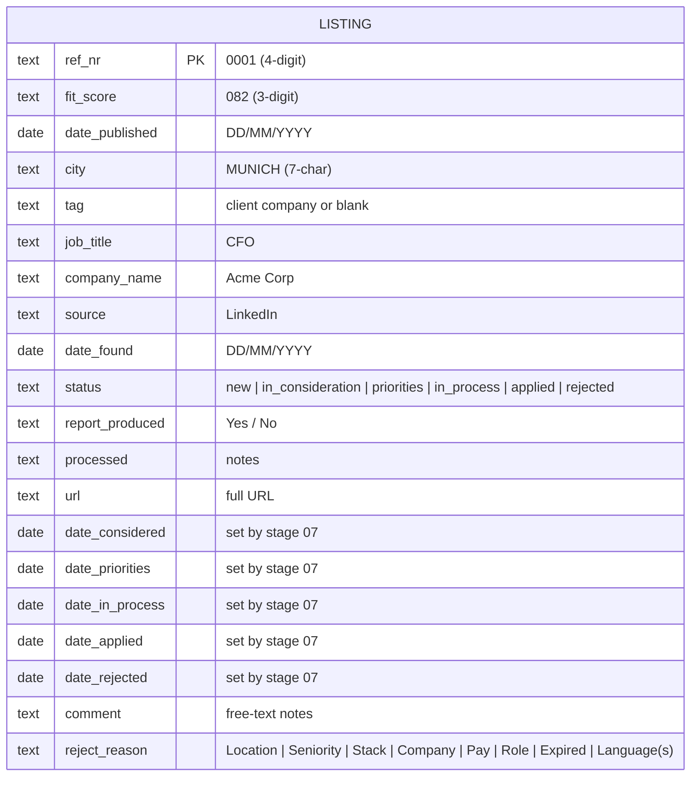

# Architecture

Visual reference for the LinkedIn Sourcing pipeline. All diagrams use [Mermaid](https://mermaid.js.org/) syntax.

---

## Module Structure

---

## Pipeline Data Flow

---

## File Lifecycle

Shows how a single listing's files evolve across stages.

---

## LLM Scoring Sequence

---

## Review Console Interactions

---

## Batch Orchestration

```mermaid
flowchart TD
    subgraph "__01_RUN_ALL.bat"
        A1[00] --> A2[01] --> A3[02] --> A4[03] --> A5[04] --> A6[05] --> A7[06]
        A7 --> A8["07 (new window)"]
        A8 --> A9["5-min countdown → hibernate"]
    end

    subgraph "__02_RUN_ALL_NOHIB.bat"
        B1[00] --> B2[01] --> B3[02] --> B4[03] --> B5[04] --> B6[05] --> B7[06]
        B7 --> B8["07 (new window)"]
    end

    subgraph "__03_EMAIL_ONLY.bat"
        C1[00] --> C3[02] --> C4[03] --> C5[04] --> C6[05] --> C7[06]
    end

    subgraph "__04_EXTRACTED.bat  (--force)"
        D3["02 --force"] --> D4["03 --force"] --> D5[04] --> D6[05] --> D7[06]
    end
```

---

## Ollama Integration

---

## Excel Database Schema

